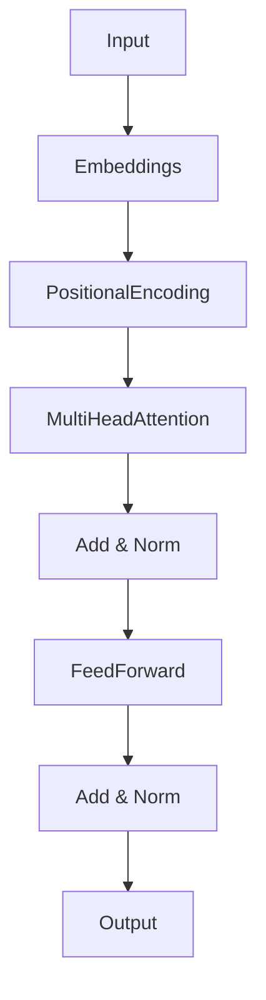

# Transformers

## Core Architecture
- **Self-Attention:** Allows the model to weigh the importance of every other token in the sequence when processing the current token.
- **Multi-Head Attention:** Multiple attention mechanisms running in parallel, allowing the model to focus on different aspects of the text (e.g., grammar, meaning).
- **Positional Encoding:** Since self-attention has no notion of word order, position vectors are added to embeddings to inject sequential information.
- **Layer Normalization & Residuals:** Keep gradients stable and allow the training of very deep networks.

