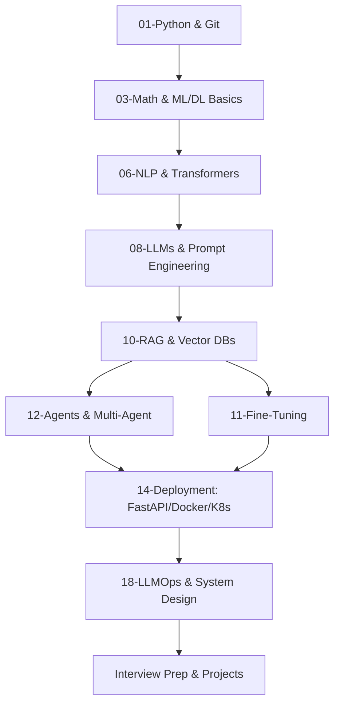

# Learning Roadmap

```mermaid
graph TD
    A[01-Python & Git] --> B[03-Math & ML/DL Basics]
    B --> C[06-NLP & Transformers]
    C --> D[08-LLMs & Prompt Engineering]
    D --> E[10-RAG & Vector DBs]
    E --> F[12-Agents & Multi-Agent]
    E --> G[11-Fine-Tuning]
    F --> H[14-Deployment: FastAPI/Docker/K8s]
    G --> H
    H --> I[18-LLMOps & System Design]
    I --> J[Interview Prep & Projects]
```

Follow this path for the most logical progression from fundamentals to production-ready AI engineering.
